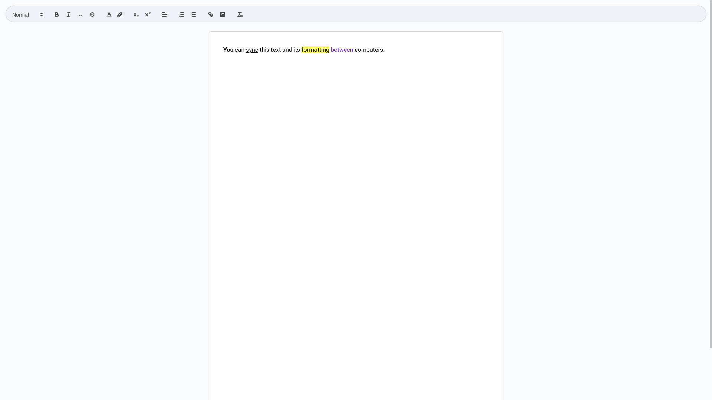

# Zenith Docs

## About

Zenith Docs is a modern, collaborative text editor inspired by Google Docs. Built with React, TypeScript, Firebase, and Quill.js, it allows users to create and edit documents in real time across multiple devices.

## Live Preview

https://zenith-docs.netlify.app/

## Features

- **Real-time Collaboration**: Edit and format text simultaneously with others, with changes synced across devices in real time using Firebase.
- **Rich Text Editing**: Utilize a powerful text editor built with Quill.js to apply formatting such as bold, italics, headers, lists, and more.
- **Auto-save**: Ensure that all changes are automatically saved to the cloud, minimizing the risk of data loss.
- **Cross-device Synchronization**: Start editing on one device and continue seamlessly on another.
- **Customizable Interface**: Choose from various text formatting options to personalize your document.
- **Modern UI**: Enjoy a clean and intuitive interface inspired by Google Docs, optimized for productivity.

## Screenshots

## Run Locally

1. Clone the project to your local machine:

`git clone https://github.com/kaklewski/zenith-docs.git`

2. Navigate to the project directory:

`cd zenith-docs`

3. Install the dependencies:

`npm install`

4. Start the development server:

`npm run dev`

## Build with Vite

1. Build the dist:

`npm run build`

2. Preview the build:

`npm run preview`
